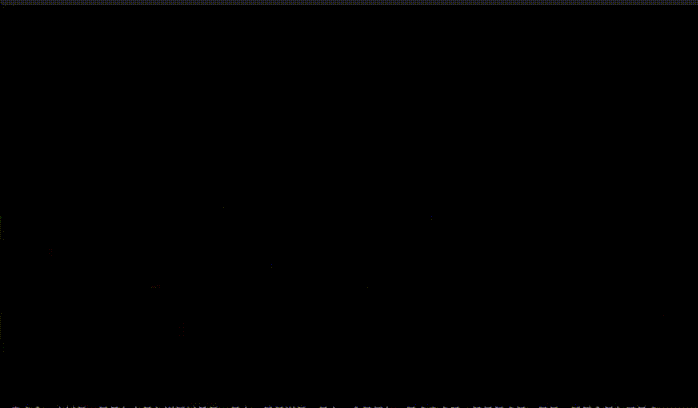

# Doom Fire

This project recreates the original doom fire algorithm based on a 2D intensity matrix and propagation with random decay/wind effect.



## Installation

```bash
pip install -r requirements.txt
```

---

## Run

```bash
python app.py
```

---


